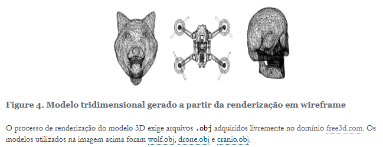

# Codigo de renderização de modelos 3D
## Contextualização:
- O formato .obj (Wavefront OBJ) é um padrão amplamente utilizado para representar modelos 3D de forma simples e legível.
- Ele armazena informações sobre vértices (v), normais (vn), texturas (vt) e faces (f), onde cada face é formada por índices que referenciam os vértices previamente definidos.
- As faces podem ser triangulares ou poligonais e podem incluir referências opcionais a coordenadas de textura e normais no formato f v/vt/vn.
- O formato .mtl (Material Template Library) é usado em conjunto com arquivos .obj para definir materiais e texturas aplicados aos modelos 3D.

---


---

## Estrutura do Código:
- A implementação do código de renderização 3D é realizada através dos arquivos: *model.h* que contém todos os protótipos de funções que serão úteis para manipulação dos modelos 3D, *model.c* é o arquivo que contém as implementações das funções de manipulação dos modelos 3D e *wireframe.c* que realiza a execução das funções implementadas.

## Definições e Struct:
- O código tem como Tamanho da imagem (WIDTH e HEIGHT) e o número máximo de vértices por face (MAX_FACE_VERTS). 

- Em *Vertex* define um vértice no espaço 3D. 
- Em *Face* define uma face que pode conter até MAX_FACE_VERTS vértices.

- Em *image*: Declara (mas não define) uma imagem em RGB com:
- *HEIGHT x WIDTH pixels (800x800)*.
- *Cada pixel tem 3 componentes: Vermelho, Verde e Azul (valores de 0 a 255)*.
- O extern apenas declara que a variável existe em outro lugar. 


```c
// model.h
#define WIDTH 800
#define HEIGHT 800
#define MAX_FACE_VERTS 32

typedef struct {
  float x, y, z;
} Vertex;

typedef struct {
  int verts[MAX_FACE_VERTS];
  int n;
} Face;

extern unsigned char image[HEIGHT][WIDTH][3];

// No moddel.c
unsigned char image[HEIGHT][WIDTH][3];

```

## Funções:
### **set_pixel**
- Essa função pinta um pixel na posição (x, y) da imagem com a cor RGB (vermelho, verde e azul), verificando se o pixel está dentro dos limites da imagem.
```c
void set_pixel(int x, int y, unsigned char r, unsigned char g, unsigned char b);
```
### **draw_line**
- Desenhar uma linha reta entre dois pontos (x0, y0) e (x1, y1) na tela (ou imagem), pixel por pixel.
- Essa função usa um algoritmo inteligente chamado Bresenham.
- `abs()` - Essa função retorna o valor absoluto de um número, ou seja, transforma números negativos em positivos.
- Algoritmo de Bresenham:
  - Ele procura o ponto mais próximo da linha entre dois pontos e pinta esse pixel.
  - Até que ele chega ao ponto final, ele vai pintando os pixels intermediários.
  - Não precisa calcular a posição de cada pixel, só precisa saber se o próximo pixel está mais perto do ponto inicial ou do ponto final.
```c
void draw_line(int x0, int y0, int x1, int y1)
{

    /*
    dx: é a distância horizontal entre os dois pontos.
    dy: é a distância vertical, mas negativa, porque no sistema de tela o eixo Y cresce para baixo.
    sx: indica se a linha vai para a direita (1) ou para a esquerda (-1).
    sy: indica se a linha vai para baixo (1) ou para cima (-1).
    */
    int dx = abs(x1 - x0), sx = x0 < x1 ? 1 : -1;
    int dy = -abs(y1 - y0), sy = y0 < y1 ? 1 : -1;
    int err = dx + dy, e2;
    // acompanhar quanto estamos desviando da linha perfeita 
    // e quando precisamos corrigir subindo ou descendo um pixel.

    while (1)
    {
        set_pixel(x0, y0, 0, 0, 0); // preto
        if (x0 == x1 && y0 == y1) // chegou ao ponto final. 
            break;


         // Variavel auxiliar para guardar o erro.
        e2 = 2 * err;

        // Mover o pixel na horizontal (eixo X).
        if (e2 >= dy)
        {
            err += dy;
            x0 += sx;
        }
        // Mover o pixel na vertical (eixo Y).
        if (e2 <= dx)
        {
            err += dx;
            y0 += sy;
        }
    }
}

```

- Outra alternativa que eu usei como solicitado:
- Desenha uma linha reta do ponto (x0, y0) até (x1, y1).

```c
void draw_line(int x0, int y0, int x1, int y1) {
  for (float t = 0.0; t < 1.0; t = t + 0.0001)
    set_pixel((int)x0+(x1-x0)*t, (int)y0+(y1-y0)*t, 0, 0, 0);
}
```

### **clr**
- Essa função limpa a imagem inteira, preenchendo-a com branco (255, 255, 255).
```c
void clr();
```

### **save**
- Essa função salva a imagem em um arquivo no formato PPM e cria um arquivo chamado "output.ppm".
```c
void save();
```

### **load_obj**
- Organiza o armazenamento dos elementos do  desenho. 
``` c
int load_obj(const char *filename, Vertex **vertices, int *vcount, Face **faces, int *fcount)
{
    /*
    filename: nome do arquivo .obj que será lido.

    vertices: ponteiro para armazenar um array dinâmico de vértices.

    vcount: ponteiro para a quantidade de vértices.

    faces: ponteiro para armazenar um array dinâmico de faces.

   fcount: ponteiro para a quantidade de faces.
    */

    FILE *file = fopen(filename, "r");
    if (!file)
    {
        perror("Erro ao abrir o arquivo");
        return 0;
    }

    char line[512]; // cada linha
    *vcount = 0;
    *fcount = 0;

    // capacidade inicial para os arrays.
    int vcapacity = 1000;
    int fcapacity = 1000;

    *vertices = malloc(vcapacity * sizeof(Vertex));
    *faces = malloc(fcapacity * sizeof(Face));
    if (!*vertices || !*faces)
    {
        perror("Erro de alocação de memória");
        fclose(file);
        return 0;
    }

    // Lê cada linha do arquivo até o fim.
    while (fgets(line, sizeof(line), file))
    {
        if (strncmp(line, "v ", 2) == 0) // linha vertice v.
        {
            // se tem muito

            if (*vcount >= vcapacity)
            {

                /*
                ele aloca espaço dinamicamente para os arrays de vértices e faces e, caso a quantidade de vértices ou faces ultrapasse a capacidade alocada inicialmente, ele dobra a capacidade alocada e realoca o espaço usando a função realloc.
                */
                vcapacity *= 2;
                *vertices = realloc(*vertices, vcapacity * sizeof(Vertex));
                if (!*vertices)
                {
                    perror("Erro ao realocar memória para vértices");
                    fclose(file);
                    return 0;
                }
            }
            sscanf(line + 2, "%f %f %f", &(*vertices)[*vcount].x,
                   &(*vertices)[*vcount].y,
                   &(*vertices)[*vcount].z);
            (*vcount)++;
        }
        else if (strncmp(line, "f ", 2) == 0)
        {
            if (*fcount >= fcapacity)
            {
                fcapacity *= 2;
                *faces = realloc(*faces, fcapacity * sizeof(Face));
                if (!*faces)
                {
                    perror("Erro ao realocar memória para faces");
                    fclose(file);
                    return 0;
                }
            }

            // inicializando o número de vértices de uma face (o campo n dentro da estrutura Face).
            Face face = {.n = 0};
            // + 2 pula o f.
            // strtok  é usada para quebrar a linha em partes (tokens) usando como separadores ("\n").
            char *token = strtok(line + 2, " \n");

            // Exemplo: se a linha for "f 1 2 3"
            //
            // O strtok vai dividir a string "1 2 3" em tokens separados:
            // token recebe "1", depois "2", depois "3"
            //
            // Cada token é convertido para um inteiro (index):
            // index será 1, depois 2, depois 3
            //
            // Esses valores são armazenados na estrutura Face:
            // face.verts = [1, 2, 3]
            // face.n = 3  (quantidade de vértices na face)
            //
            // Ao final, essa face é armazenada no vetor de faces:
            // (*faces)[(*fcount)++] = face;
            //
            // Ou seja, o código lê o arquivo .obj linha por linha,
            // e quando encontra uma linha que começa com 'f',
            // ele interpreta os índices dos vértices e salva na estrutura Face.

            while (token && face.n < MAX_FACE_VERTS)
            {
                int index;
                if (sscanf(token, "%d", &index) == 1)
                {
                    face.verts[face.n++] = index;
                }
                token = strtok(NULL, " \n");
            }
            (*faces)[(*fcount)++] = face;
        }
    }

    fclose(file);
    printf("Total de vertices carregados: %d\n", *vcount);
    printf("Total de faces carregadas: %d\n", *fcount);
    return 1;
}
```

### **resizing**
- Essa função converte coordenadas 3D para coordenadas de tela 2D e depois desenha uma linha entre dois pontos.

- Pega dois pontos (v0 e v1) que estão entre -1 e 1 (coordenadas normalizadas).

- Converte esses pontos para a tela, que vai de 0 até a largura (WIDTH) e altura (HEIGHT).

- Desenha uma linha entre eles com a função draw_line.
```c
resizing(Vertex v0, Vertex v1);
```
### **render_faces**
- Percorre todas as faces do modelo e desenha suas linhas (arestas) na tela, liga os vértices de cada face um a um
```c
void render_faces(Vertex *vertices, Face *faces, int vcount, int fcount);
```

## Função main está no Wireframe e sua execução:
- Execução: 
``` c
// gcc wireframe.c model.c -o imageff -lm
// ./imageff
```